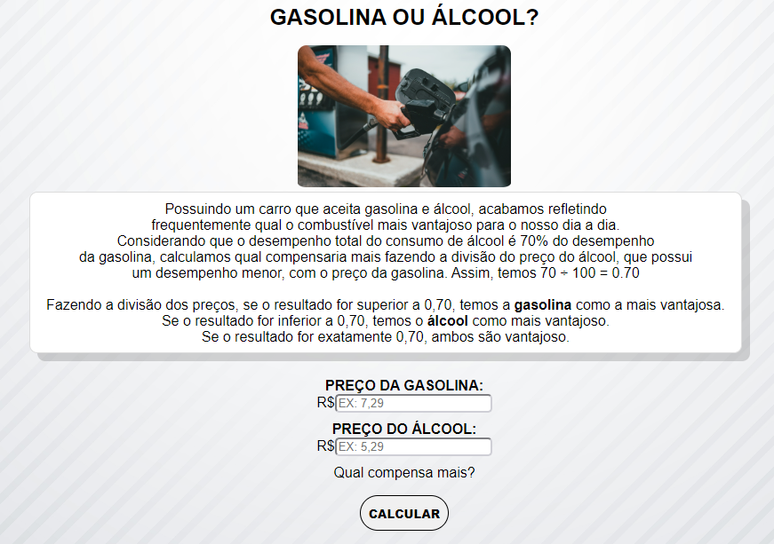

## Fuel Prices Validator

Simple application that checks what fuel type is better, ethanol or gasoline, according to fuel prices

In Brazil, most cars accept both fuel types, but gasoline performs much better. Ethanol performance is equivalent to 70% of gasoline performance. This tool applies a formula to verify which fuel type is better depending on prices.

Made this simple tool as a project for college.

## Screenshots

## How to Test

Clone this project using the Git command line and open the index.html file.
